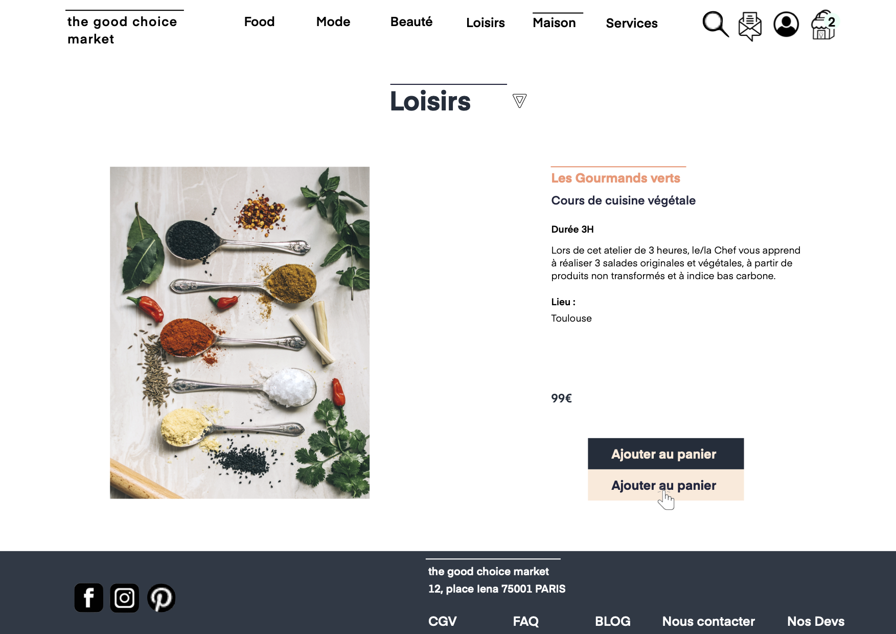

# L'API The Good Choice Market

## Cahier des charges

### OBJECTIFS

Aujourd’hui, l’offre de produits, objets et services Vegan et éthique s’est beaucoup étendue.

En ligne via leurs sites propres ou sur des sites généralistes, en physique dans les supermarchés et dans les boutiques spécialisées.

Malheureusement, il y a encore de nombreuses petites et moyennes marques qui ont une offre qualitative mais qui n’ont pas encore de canaux de distribution en ligne autre que leur propre site ou un réseau social.

Ce site leur permettrait d’avoir une vitrine pour vendre leurs produits ( épiceries, mode, cosmétiques,…) en faisant travailler leur infrastructure de livraison.

### PUBLIC

Clients

- Personnes déjà clientes de ces marques et qui souhaitent commander à nouveau des produits sur une plateforme plus généraliste et pratique.
- Personnes qui de façon occasionnelle achèteraient ces catégories de produits.
- Des personnes souhaitant acheter pour la première fois ce genre de produits.

Partenaires

- Les marques partenaires qui souhaitent avoir une vitrine de vente de leurs produits qui ont des valeurs communes au site.

### Navigateurs compatibles

- Google Chrome
- Safari 13.0
- Mozilla Firefox

### CONTENU

- Documents ( articles de blog )
- Les photos et videos des marques et des produits.
- Une facture à télécharger

#### Répartition des rôles

- Product Owner ( Emiii )
- Scrum Master ( Thomas )
- Git Master ( Anthoine )
- Lead Dev Back ( Jean Michel )
- Lead Dev Front ( Stella )
- Référents technique pour chaque technologies( à voir)

### VISUEL

#### Couleurs / LOGO / Desktop view V3


#### Effets Bouton/ Desktop view V4 / page produits / page produit détail

Bouton: couleurs bleu foncé + en fonction du titre nude ou vert.

Effet de survol : les couleurs s’inversent.

Couleurs :

- Bleu foncé : footer et couleur de fond des boutons.
- Orange : titres pour les sous catégories de biens immatériels ( loisirs et services).
- Vert : titres pour les sous catégories de biens matériels.
- Nude : pour le texte sur les boutons des catégories orange. Couleur de fond de la page d'accueil pour le slogan.

#### Desktop view V4 / page produits / page produit détail/ panier





### User’s stories

#### Visiteur (Guest)

PAGE D'ACCUEIL

| En tant que | Je veux                                         | Afin de                                |
| ----------- | ----------------------------------------------- | -------------------------------------- |
| visiteur    | une page d'accueil                              | prévisualiser le contenu du site       |
| visiteur    | pouvoir m'inscrire                              | avoir un compte pour valider un panier |
| visiteur    | visualiser les catégories sur la page d'accueil | ...                                    |
| visiteur    | visualiser les marques sur la page d'accueil    | ...                                    |
| visiteur    | faire une recherche sur la page d'accueil       | afin d’accéder aux résultats           |

CGV

| En tant que | Je veux                                                         | Afin de |
| ----------- | --------------------------------------------------------------- | ------- |
| visiteur    | visualiser les conditions d’utilisation sur la page en question | ...     |

BLOG

| En tant que | Je veux                                            | Afin de |
| ----------- | -------------------------------------------------- | ------- |
| visiteur    | visualiser les articles de blog sur la partie blog | ...     |

NEWSLETTER

| En tant que | Je veux                    | Afin de                     |
| ----------- | -------------------------- | --------------------------- |
| visiteur    | m’inscrire à la newsletter | afin de pouvoir la recevoir |

VALEURS

| En tant que | Je veux                                          | Afin de |
| ----------- | ------------------------------------------------ | ------- |
| visiteur    | visualiser les “valeurs” sur la page en question | ...     |

MARQUES

| En tant que | Je veux                                                              | Afin de                             |
| ----------- | -------------------------------------------------------------------- | ----------------------------------- |
| visiteur    | pouvoir cliquer sur les liens qui emmènent sur les sites des marques | afin de se renseigner sur celles-ci |

#### Client (Utilisateur connecté)

PROFIL CLIENT

| En tant que        | Je veux                                           | Afin de                                  |
| ------------------ | ------------------------------------------------- | ---------------------------------------- |
| En tant que client | J'ai besoin de me connecter sur la page d’accueil | accéder à la page client sprint          |
| En tant que client | d’accéder à la page client                        | de pouvoir visualiser mes données client |
| En tant que client | d’accéder à la page client                        | de pouvoir modifier mes données client   |
| En tant que client | d’accéder à la page client                        | de pouvoir supprimer mon compte client   |
| En tant que client | d’accéder à la page client                        | de contacter le service client           |

PANIER/PAIEMENT

| En tant que        | Je veux                                   | Afin de                                  |
| ------------------ | ----------------------------------------- | ---------------------------------------- |
| En tant que client | J'ai besoin de me connecter sur le panier | pour finaliser ma commande               |
| En tant que client | j’ai besoin de rentrer mes coordonnées    | pour finaliser ma commande et être livré |

#### Admin (Administrateur connecté)

| En tant que       | Je veux                        | Afin de                                            |
| ----------------- | ------------------------------ | -------------------------------------------------- |
| En tant que admin | me connecter en tant que admin | de pouvoir visualiser les données de chaque client |
| En tant que admin | me connecter en tant que admin | de pouvoir éditer des données client               |
| En tant que admin | me connecter en tant que admin | de pouvoir ajouter des articles de blog            |
| En tant que admin | me connecter en tant que admin | de pouvoir ajouter des données marques             |

### Liste des technologies utilisées

#### GENERAL

- ESLINT
- JSDoc ( description des fonctions )
- Swagger ( documentation )
- JEST ( tests unitaires )

#### BACK

- SQITCH ( versioning)
- NodeJs ( serveur )
- Express ( serveur )
- DotEnv ( variables d’environnement )
- Debug ( Consoles Logs avancés )
- JOI ( vérification des données du front )
- Faker ( génération de données )
- Express Session ( gérer les sessions )
- NODEMON ( lancer le serveur )
- PG ( base de données Postgres )
- BCRYPT ( chiffrer les mots de passes )
- MULTER ( déchiffrer les bodies )
- Cors ( rendre disponible l’API )
- SOCKET IO ( discussion entre front/back ) v2

#### FRONT

- Yarn
- React
- React-router-dom
- Webpack
- Babel

#### Bibliothèque

- Redux

#### Tests

- Enzyme
- TU

#### Communication

- WebSocket

#### Authentification

- HTTP
- Axios (AJAX)
- PWT

### MVP

Naviguer dans les différentes catégories et détails de chaque produit.

Pouvoir chercher dans toute la base de données, une marque ou un produit / service.

Cette partie devra offrir la possibilité au client de nous contacter via un formulaire.

L’utilisateur peut fournir son adresse mail pour recevoir une newsletter.

Lorsqu'on ajoute des produits au panier, ceux-ci s’affichent sur la page panier.

Créer un compte et pouvoir le supprimer.

Compatible Google chrome.

### INTERACTIVITÉ - FONCTIONNALITÉS

#### V1

Shopping

- Explorer les différentes catégories et détails de chaque produit.

Recherche

- Pouvoir chercher dans toute la base de données, une marque ou un produit / service.

Contact

- Cette partie devra offrir la possibilité au client de nous contacter via un formulaire.

Newsletter

- L’utilisateur peut fournir son adresse mail pour recevoir une newsletter.

Panier

- Récapitule les produits / services ajoutés, avec un total avec et sans TTC,
- Calcul les frais d'expédition en fonction du cahier des charges de chaque marque,
- Propose de rentrer un code promo,
- Il lui faudra ensuite créer un compte pour terminer la commande,
- Il devra rentrer ses coordonnées de paiement en fonction des options proposées.

Mon compte

- Mes données personnelles,
- Historique des commandes effectuées,
- Suivre la livraison d’une commande en cours,
- Effectuer une demande de retour,
- Obtenir une facture...

En Extra :

- Blog

Si on a le temps, on pourrait faire une ou deux page de Blogs pour mettre en avant une ou deux marques ( historique de la marque, description des produits, etc.... ).

## Plan du site


### Routes prévues

FRONT

- /accueil
- /catégorie(route paramétrée)
- /produit(route paramétrée)
- /valeurs
- /contact
- /FAQ
- /CGV
- /blog
- /blog/articles
- /mon compte
- /mon compte/aide & retours
- /login / connexion

BACK

|          | Admin | GET | GET ALL | POST | PATCH | DELETE |
| -------- | ----- | --- | ------- | ---- | ----- | ------ |
| company  |       | X   |         |      |       |        |
| company  | X     | X   | X       | X    | X     | X      |
| brand    |       | X   |         |      |       |        |
| brand    | X     | X   | X       | X    | X     | X      |
| product  |       | X   | X       |      |       |        |
| product  | X     | X   | X       | X    | X     | X      |
| user     |       | X   |         | X    | X     | X      |
| user     | X     | X   | X       | X    | X     | X      |
| category |       | X   | X       |      |       |        |
| category | X     | X   | X       | X    | X     | X      |

### LIENS EXTERNES

Liens externes qui ouvrent un nouvel onglet si les marques ont un site.

Liens externes qui envoient sur les réseaux sociaux du site.

Page 425 ( demande pas encore réalisée).

### DÉLAI

Le projet global est à réaliser en un mois.

- SPRINT 0 : organisation et architecture.
- SPRINT 1 : écrire le code des fonctionnalités.
- SPRINT 2 : écrire le code des fonctionnalités et les tests.
- SPRINT 3: Debugs et refactorisation.

### Evolutions possibles

#### V2

##### Général

Le référencement à améliorer côté front pour une visibilité augmentée - SEO

Budgétiser pour une campagne web et la communication via les réseaux sociaux

Affiner le modèle économique : ex = contrepartie financière ( un pourcentage prélevé sur ce qu'ils vendent uniquement).

##### Paiement

Choisir les organismes de paiement en ligne

Donner la possibilité au client de générer une facture

Le client pourra ajouter un code promo

Frais de port dynamiques en fonction du montant du panier.

##### Client

Organiser les demandes de retour

Le client pourra suivre la livraison de sa commande en direct

ChatBot sur le site ( V1?).

##### Back

Gestion de la base de données en fonction de l'augmentation des commandes

Trouver un moyen de gérer les frais de port dynamiques dans la base de données.

## MCD


## MLD

```txt
company = (company_id INT, name VARCHAR(50), city VARCHAR(50), address VARCHAR(50), phone_number INT, email VARCHAR(50), siret_number INT, created_at DATETIME, updated_at DATETIME);

brand = (brand_id INT, brand_name VARCHAR(50), slogan VARCHAR(50), logo VARCHAR(50), activity_field VARCHAR(50), delivery_cost DECIMAL(15,2), created_at DATETIME, updated_at DATETIME, #company_id*);

tva = (tva_id INT, rate DECIMAL(15,2), created_at DATETIME, updated_at DATETIME);

user_infos = (user_infos_id INT, firstname VARCHAR(50), lastname VARCHAR(50), birthday VARCHAR(50), email VARCHAR(50), password VARCHAR(50), phone_number INT, address VARCHAR(50), postal_code VARCHAR(50), city VARCHAR(50), country VARCHAR(50), created_at DATETIME, updated_at DATETIME);

category = (category_id INT, category_name VARCHAR(50), created_at DATETIME, updated_at DATETIME);

sub_category = (sub_category_id INT, sub_category_name VARCHAR(50), created_at DATETIME, updated_at DATETIME, #category_id*);

product = (product_id INT, product_name VARCHAR(50), description VARCHAR(50), image VARCHAR(50), location VARCHAR(50), barcode INT, expiration_date VARCHAR(50), height VARCHAR(50), wight VARCHAR(50), depth VARCHAR(50), weight VARCHAR(50), size VARCHAR(50), price_ht CURRENCY, price_promo CURRENCY, price_kg CURRENCY, created_at DATETIME, updated_at DATETIME, #brand_id*, #tva_id*, #sub_category_id*, #category_id*);

basket = (#product_id, #user_infos_id);
```

## Dictionnaire des données

### company

| champ        | type        | description                              | commentaire                                        | exemple                    |
| ------------ | ----------- | ---------------------------------------- | -------------------------------------------------- | -------------------------- |
| id           | INTEGER     | PRIMARY KEY GENERATED ALWAYS AS IDENTITY | Identifiant de l’entreprise dans la base de donnée | 1 ou 2584                  |
| name         | TEXT        | NOT NULL                                 | Nom de l’entreprise                                | ‘toto & co’                |
| city         | TEXT        | NOT NULL                                 | Ville du siège de l’entreprise                     | ‘totoland’                 |
| address      | TEXT        | NOT NULL                                 | Adresse du siège de l’entreprise                   | ‘42 rue de totoland’       |
| phone_number | INTEGER     | NULL                                     | Numéro de téléphone de l’entreprise                | 0102030405                 |
| email        | TEXT        | NOT NULL                                 | Adresse mail de l’entreprise                       | ‘toto@toto.com’            |
| siret_number | BIGINT      | NOT NULL                                 | Numéro d’identification de l’entreprise            | 14 chiffres 12345678912345 |
| created_at   | TIMESTAMPTZ | NOT NULL NOW()                           | Date d’ajout de l’entreprise                       |                            |
| updated_at   | TIMESTAMPTZ | NULL                                     | Date de la dernière modification                   |                            |

### brand

| champ          | type        | description                              | commentaire                      | exemple               |
| -------------- | ----------- | ---------------------------------------- | -------------------------------- | --------------------- |
| id             | INTEGER     | PRIMARY KEY GENERATED ALWAYS AS IDENTITY | Identifiant de la marque         | 42 ou 32              |
| brand_name     | TEXT        | NOT NULL                                 | Nom de la marque                 | ‘totoFaitDesTruc’     |
| slogan         | TEXT        | NULL                                     | Slogan de la marque              | ‘totomatization’      |
| logo           | TEXT        | NULL                                     | Logo de la marque                | ‘https//totologo.png’ |
| activity_field | TEXT        | NOT NULL                                 | Domaine d’activité de la marque  | ‘textile’             |
| delivery_cost  | FLOAT       | NOT NULL                                 | Frais d'expédition               | 50                    |
| company_id     | INTEGER     | FOREIGN KEY REFERENCE company            | Frais de livraison               | 2                     |
| created_at     | TIMESTAMPTZ | NOT NULL NOW()                           | Date d’ajout de la marque        |                       |
| updated_at     | TIMESTAMPTZ | NULL                                     | Date de la dernière modification |                       |

### product

| champ           | type        | description                              | commentaire                      | exemple                                    |
| --------------- | ----------- | ---------------------------------------- | -------------------------------- | ------------------------------------------ |
| id              | INTEGER     | PRIMARY KEY GENERATED ALWAYS AS IDENTITY | L'identifiant du produit         | 67 ou 76                                   |
| name            | TEXT        | NOT NULL                                 | Le nom du produit                | ‘table’                                    |
| description     | TEXT        | NOT NULL                                 | La description du produit        | ‘j’aime bien les tables’                   |
| image           | TEXT        | NOT NULL                                 | L’image du produit               | ‘https//table.jpg’                         |
| location        | TEXT        | NULL                                     | Le lieu de l'événement           | ‘dans le salon’                            |
| barcode         | BIGINT      | NULL                                     | Code-barre du produit            | 8 ou 13 chiffres 12345678 ou 1234567891234 |
| expiration_date | TEXT        | NULL                                     | Date d’expiration du produit     | ‘32/13/2022’                               |
| height          | TEXT        | NULL                                     | hauteur du produit               | ‘12.5’                                     |
| wight           | TEXT        | NULL                                     | largeur du produit               | ‘65.000001g’                               |
| depth           | TEXT        | NULL                                     | profondeur du produit            | ‘0.9999cm’                                 |
| weight          | TEXT        | NULL                                     | poids du produit                 | ‘659’                                      |
| size            | TEXT        | NULL                                     | taille du produit ( vêtements )  | ‘L’                                        |
| price_ht        | NUMERIC     | NOT NULL                                 | prix hors-taxe du produit        | 10.0                                       |
| price_promo     | NUMERIC     | NULL                                     | prix avec promotion              | 9.99                                       |
| price_kg        | NUMERIC     | NULL                                     | prix au kilo                     | 12.99                                      |
| tva_id          | INTEGER     | FOREIGN KEY REFERENCE tva                | taux de TVA appliquée au produit | 2                                          |
| brand_id        | INTEGER     | FOREIGN KEY REFERENCE brand              | ID de la marque du produit       | 8                                          |
| sub_category_id | INTEGER     | FOREIGN KEY REFERENCE sub_category       | ID de la sous category           | 3                                          |
| created_at      | TIMESTAMPTZ | NOT NULL NOW()                           | Date d’ajout du                  |                                            |
| updated_at      | TIMESTAMPTZ | NULL                                     | Date de la dernière modification |                                            |

### tva

| champ      | type        | description                              | commentaire                      | exemple  |
| ---------- | ----------- | ---------------------------------------- | -------------------------------- | -------- |
| id         | INTEGER     | PRIMARY KEY GENERATED ALWAYS AS IDENTITY | Identifiant de la tva            | 98 ou 99 |
| rate       | FLOAT       | NOT NULL                                 | Taux de tva                      | 5.5      |
| created_at | TIMESTAMPTZ | NOT NULL NOW()                           | Date d’ajout du taux de TVA      |          |
| updated_at | TIMESTAMPTZ | NULL                                     | Date de la dernière modification |          |

### category

| champ      | type        | description                              | commentaire                      | exemple   |
| ---------- | ----------- | ---------------------------------------- | -------------------------------- | --------- |
| id         | INTEGER     | PRIMARY KEY GENERATED ALWAYS AS IDENTITY | Identifiant de la catégorie      | 65 ou 353 |
| name       | TEXT        | NOT NULL                                 | Nom de la catégorie              | ‘Meubles’ |
| created_at | TIMESTAMPTZ | NOT NULL NOW()                           | Date d’ajout de la catégorie     |           |
| updated_at | TIMESTAMPTZ | NULL                                     | Date de la dernière modification |           |

### user

| champ        | type        | description                              | commentaire                           | exemple                    |
| ------------ | ----------- | ---------------------------------------- | ------------------------------------- | -------------------------- |
| id           | INTEGER     | PRIMARY KEY GENERATED ALWAYS AS IDENTITY | Identification de l’utilisateur       | 54 ou 6686                 |
| firstname    | TEXT        | NOT NULL                                 | Le prénom de l’utilisateur            | ‘toto’                     |
| lastname     | TEXT        | NOT NULL                                 | Le nom de l’utilisateur               | ‘tata’                     |
| birthday     | TEXT        | NULL                                     | La date de naissance de l’utilisateur | ‘31/00/2000’               |
| email        | TEXT        | NOT NULL                                 | L’adresse mail de l’utilisateur       | ‘totoofficiel@totoland.to’ |
| password     | TEXT        | NOT NULL                                 | Le mot de passe de l’utilisateur      | ‘1234toto’                 |
| phone_number | INTEGER     | NULL                                     | Le numéro de téléphone                | 0102030405                 |
| address      | TEXT        | NULL                                     | L’adresse de l’utilisateur            | ‘32 rue de paris’          |
| postal_code  | TEXT        | NULL                                     | Le code postal                        | ‘2A010’                    |
| city         | TEXT        | NULL                                     | La ville                              | ‘totoville’                |
| country      | TEXT        | NULL                                     | Le pays de l’utilisateur              | ‘totoland’                 |
| created_at   | TIMESTAMPTZ | NOT NULL NOW()                           | Date d’ajout de l’utilisateur         |                            |
| updated_at   | TIMESTAMPTZ | NULL                                     | Date de la dernière modification      |                            |

### buy

| champ      | type    | description                              | commentaire                | exemple |
| ---------- | ------- | ---------------------------------------- | -------------------------- | ------- |
| id         | INTEGER | PRIMARY KEY GENERATED ALWAYS AS IDENTITY | Identifiant de l’achat     | 1 ou 3  |
| user_id    | INTEGER | FOREIGN KEY REFERENCE user               | Identifiant du compte user | 3       |
| product_id | INTEGER | FOREIGN KEY REFERENCE product            | identifiant du produit     | 6       |

### sub_category

| champ       | type    | description                              | commentaire                                   | exemple   |
| ----------- | ------- | ---------------------------------------- | --------------------------------------------- | --------- |
| id          | INTEGER | PRIMARY KEY GENERATED ALWAYS AS IDENTITY | Identifiant de la liaison produit / catégorie | 654 ou 53 |
| name        | TEXT    | NOT NULL                                 | Nom de la sous category                       | Soin      |
| category_id | INTEGER | FOREIGN KEY REFERENCE category           | identifiant du produit                        | 4         |
